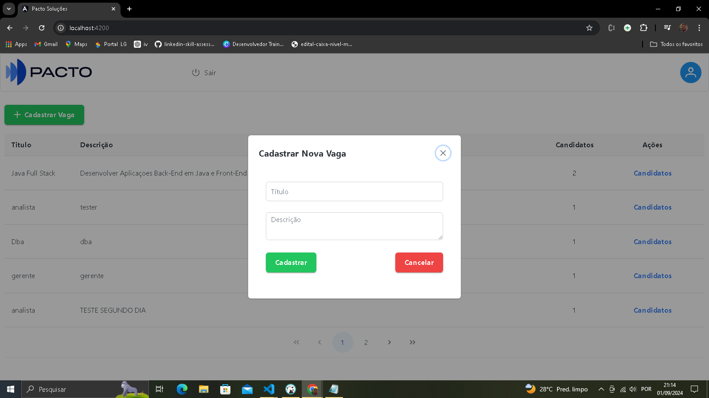
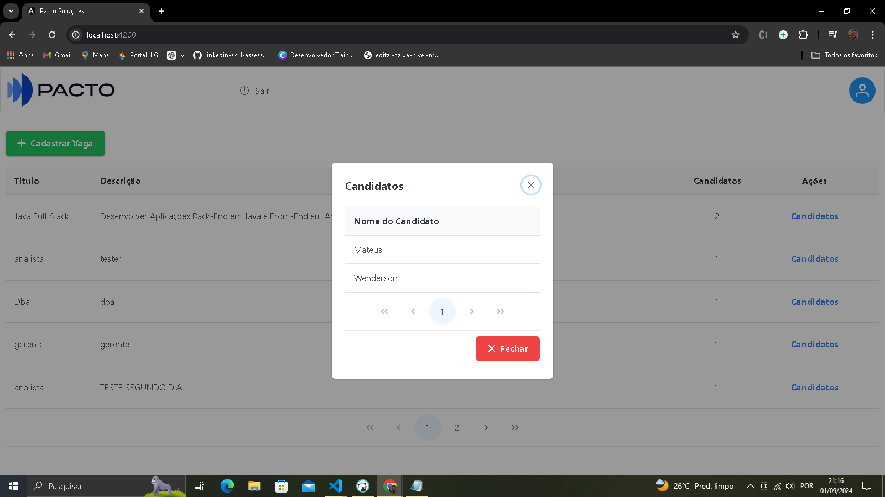
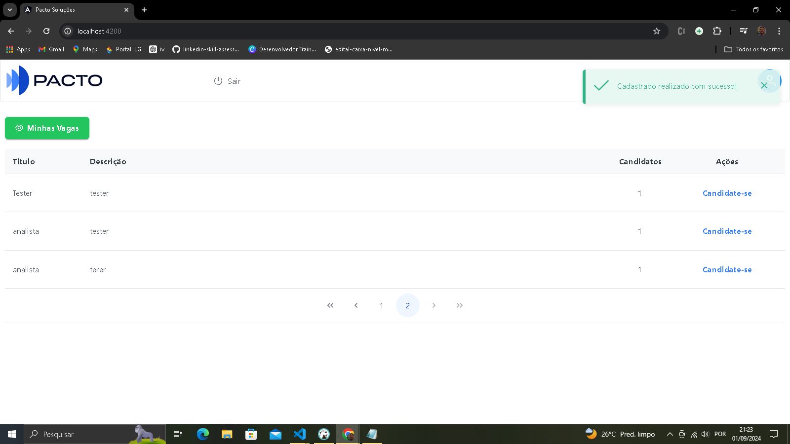
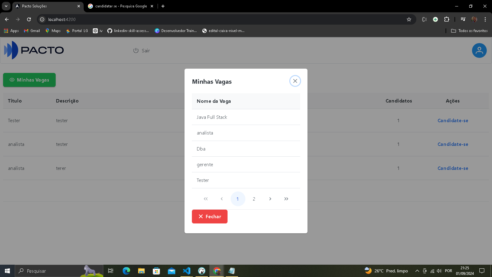
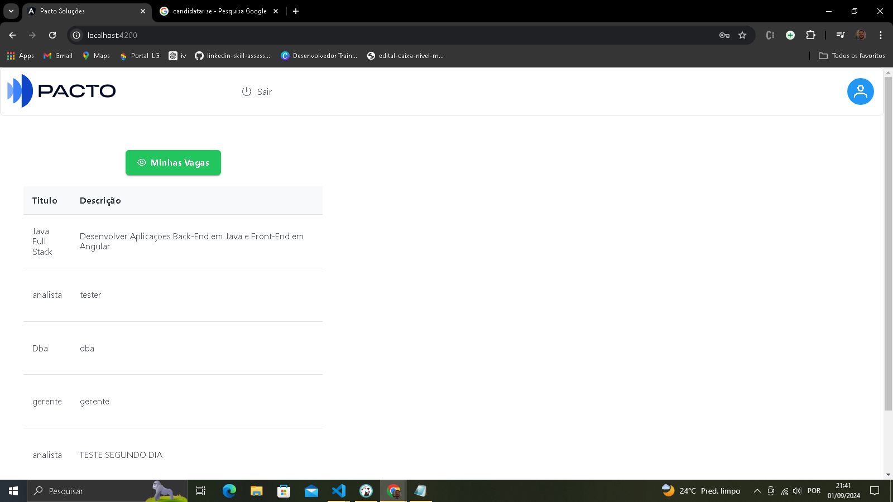
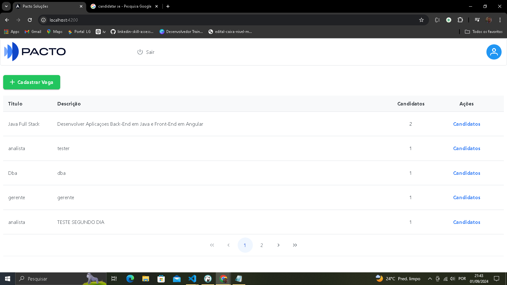
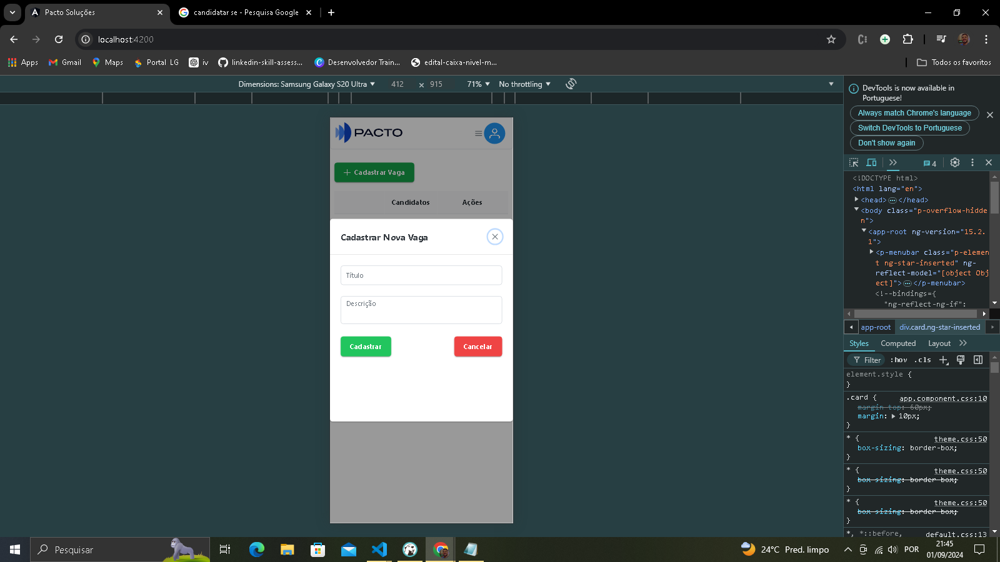

<h1>Cadastro de Vagas</h1>
<h4>Resquisitos BACK-END</h4>
<ul>
<li><b>JAVA: </b> Para executar a API desenvolvida em SpringBoot é necessário ter instalada no computador versão do java 17 ou superior.</li>
<li><b>PORTA: </b> Foi definido no arquivo de configuração <strong>application.properties</strong> a porta de execução da API sendo 8081, sendo obrigatório rodar nessa porta devido o front-end estar configurado para fazer requisições montando a URL usando essa porta.</li>
</ul>
<h4>Resquisitos FRONT-END</h4>
<ul>
<li><b>NODE: </b> Para executar o Front desenvolvido em Angular é necessário ter instalada no computador versão do Node.js 16.x ou superior.</li>
<li><b>PORTA: </b> Por padrão o Angular usa a porta 4200 para rodar a aplicação, caso a porta esteja em uso no seu computador pode-se rodar em outra porta especificando no comando ng serve --port "número da porta" ao iniciar a aplicação.</li>
</ul>
<h2>Executando a aplicação</h2>

 Baixe os arquivos usando o comando git clone https://github.com/wendersonads/cadastro-vagas-pacto.git ou baixando diretamente o arquivo ZIP disponível no repositório.

<h4>BACK-END</h4>
<ul>
<li> Para executar a API abra a pasta Back-End em qualquer IDE com suporte  para executar JAVA/SPRINGBOOT ou editor de texto como VISUAL STUDIO CODE e execute a aplicação. <b>OBS: Banco de dados POSTGRESQL está sendo executado em uma VPS não havendo necessidade de configurar localmente, sendo assim as configurações estão sendo aplicadas no arquivo de configuração application.properties</b>
</ul>
<h4>FRONT-END</h4>
<ul>
<li> Para executar o FRONT abra a pasta Front-End em qualquer editor de texto como VISUAL STUDIO CODE ou qualquer um de preferência, execute o comando <b>npm install --force</b> e em seguida <b>ng serve</b> <b>ou ng serve --port "numero da porta"</b> caso a porta 4200 esteja em uso. <b> OBS: O comando deve ser npm install --force devido o projeto estar dando conflito entre versões das dependências</b>
</ul>
<h2>Explicando o Sistema</h2>

O Sistema foi desenvolvido para dois perfis de acesso sendo <b> 1-Admnistrador e 2-Candidato</b>

<ul>
<li><b>Perfil Administrador: </b> O perfil de administrador é o perfil de acesso configurado para o usuário cadastrar novas vagas e visualizar os candidatos que se candidataram as vagas, <b>Para o acesso use USUÁRIO: Admin e SENHA: admin</b></li>

EXEMPLO: 

    

    

<li><b>Perfil Candidato: </b> O perfil de candidato é o perfil de acesso configurado para o usuário se candidatar a novas vagas e visualizar as vagas na qual candidatou-se <b>Para o acesso crie um novo cadastro, novos cadastros já estão configurados para receber o perfil de candidato</b></li>

EXEMPLO: 

    

    

</ul>
<h2>Página principal Front-End</h2>

Ao fazer o acesso após o login deve-se atualizar a página manualmente para carregar o componente table corretamente, inicialmente será carregada com dados porém por um erro no comenponente mostra em tamanho reduzido, correção estará disponível na próxima versão.

EXEMPLO: 

    

APÓS RECARREGAR: 

    

<h2>Considerações finais</h2>

Alguns dados estão sendo armazenados no localStorage como Token e dados do usuário, sendo possível visualizar na aba inspecionar do navegador. As requisições na api estão sendo validadas, ou seja, a API esta bloqueando requisição que não contém token no Header, todos os métodos e relacionamentos entre classes estão disponíveis na pasta Back-End. Telas adaptadas as telas de dispositivos móveis conforme solicitado no documento de requisítos

EXEMPLO: 

    

